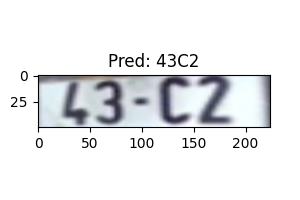
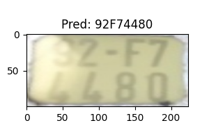
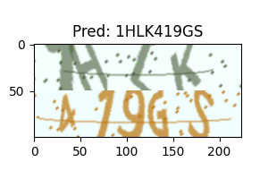
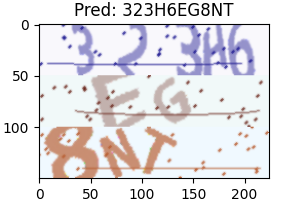

 


# MultiLineAttentionOCR
This repository presents a Pytorch implementation of deep learning models for Optical Character Recognition (OCR) applied to a multi-line image text dataset. The implementation includes a foundational Convolutional Recurrent Neural Network (CRNN) model, originally proposed by Shi et al in their paper titled "[An End-to-End Trainable Neural Network for Image-based Sequence Recognition and Its Application to Scene Text Recognition](https://arxiv.org/abs/1507.05717)", and an attention-based decoder autogressive approach, as introduced in [Attention-based Extraction of Structured Information from Street View Imagery](https://arxiv.org/abs/1704.03549) by Wojna et al. 


<p align="center">
    
    
    <br/>
    <em>Example of inference results on single-line and two-line ALPR datasets.</em>
</p>
<p align="center">
    
    
    <br/>
    <em>Example of inference results on two-line and three-line Synthetic Captcha dataset.</em>
</p>

## Installation
Virtual environment is recommended to install this repo.
1. Clone the repository. 
```bash
git clone https://github.com/tanmnguyen/MultiLineAttentionOCR.git
```
2. Install the dependencies
```bash

cd MultilineAttentionOCR/
pip install -r requirements 
```

## Inference 
To run the inference for a given image, run the following CLI. 
```bash
python inference.py --weight path/to/.pt/model --image path/to/image/file
```
Note that the inference is configured based on `configs/default-config.cfg` file. Please update the settings to accomodate your data specification such as image dimension. 

## Training 
For training on your own dataset, execute the following CLI command.
```bash
python train.py --cfg path/to/.cfg/file
```
Examples of config files for training our ALPR and synthetic Captcha dataset are provided in `configs/` folder. To use the default program to train your model, please structure your training data as a folder containing your images and labels file as follows:
```
- Training folder
  |- name-of-your-image-1.png 
  |- name-of-your-image-1.txt
  |- name-of-your-image-2.png 
  |- name-of-your-image-2.txt
```
Where the `.txt` files contain a string label of the corresponding ground truth text image. 

**Note**: The default setting trains your image in RGB format. 

## Dataset 
The repository includes a program to help generate a synthetic captcha dataset `genCaptchaImages.py`. Run the program with the following arguments to generate your dataset. 
```bash 
Python genCaptchaImages.py --num 1000 --lines 2
```
- The num argument specifies the number of images to be generated 
- the lines argument indicates the number of text lines for each image. 

## References 
[1] Baoguang Shi, Xiang Bai, and Cong Yao. *An End-to-End Trainable Neural Network for Image-based Sequence Recognition and Its Application to Scene Text Recognition.* 2015. [arXiv:1507.05717](https://arxiv.org/abs/1507.05717), arXiv preprint, cs.CV.

[2] Zbigniew Wojna, Alex Gorban, Dar-Shyang Lee, Kevin Murphy, Qian Yu, Yeqing Li, Julian Ibarz. *Attention-based Extraction of Structured Information from Street View Imagery.* 2017. [arXiv:1704.03549](https://arxiv.org/abs/1704.03549), arXiv preprint, cs.CV.